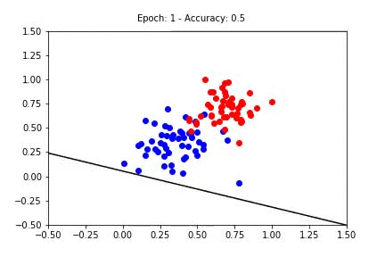

# Interactive Perceptrons

Build logical operators manually tweaking weights and biases. Animate Perceptron Training Results.

Inspired by Lesson 2.8 "Perceptrons as Logical Operators" and Lesson 2.10 "Perceptron Algorithm" from Udacity course [Intro to Deep Learning with PyTorch](https://www.udacity.com/course/deep-learning-pytorch--ud188).

**Perceptrons Included:**
* AND Perceptron
* OR  Perceptron
* NOT Perceptron
* "XOR Perceptron"
* XOR 2-Layer Perceptron
* Animated Perceptron




## Requirements
`python3` `jupyter` `numpy` `matplotlib` `ipywidgets`

## Installation

1. Clone this repo.
```
git clone https://github.com/tsavchyn/interactive-perceptrons.git
```
2. Install dependencies.

With conda:
```bash
conda install numpy matplotlib ipywidgets
```
With pip:
```bash
pip install numpy matplotlib ipywidgets
jupyter nbextension enable --py widgetsnbextension
```

## Usage

Go to `notebooks` folder

Open `logical_perceptrons.ipynb` in your `jupyter`.

For Animated Perceptron open `perceptron_algorithm.ipynb`.

Have fun!
