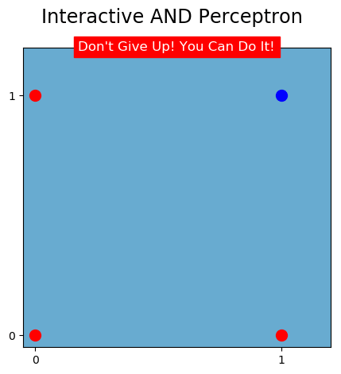
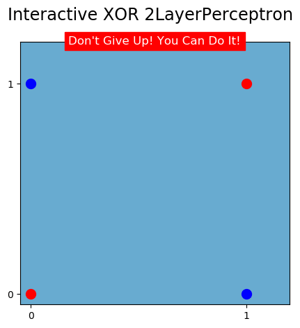

# Interactive Perceptrons

[](https://colab.research.google.com/github/tsavchyn/interactive-perceptrons/blob/master/perceptrons-in-colab.ipynb)

The main aim of this nanoproject is to help you understand intuitively and interactively the role of Weights and Biases.
Build logical operators by manually tweaking weights and biases values. Inspired by Lesson 2.8 "Perceptrons as Logical Operators" from Udacity course [Intro to Deep Learning with PyTorch](https://www.udacity.com/course/deep-learning-pytorch--ud188).

**Perceptrons Included:**

- AND Perceptron
- OR  Perceptron
- NOT Perceptron
- "XOR Perceptron"
- XOR 2-Layer Perceptron




## Requirements
`python3` `jupyter` `numpy` `matplotlib` `ipywidgets`

## Installation

1. Clone this repo
```
git clone https://github.com/tsavchyn/interactive-perceptrons.git
```

2. Install dependencies
```bash
pip install -r requirements.txt
jupyter nbextension enable --py widgetsnbextension
```

## Usage

Open `perceptrons.ipynb` in your `jupyter`.

Have fun!
